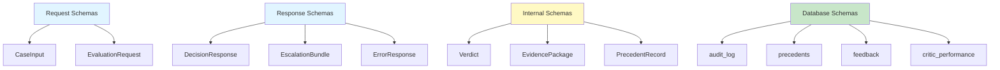
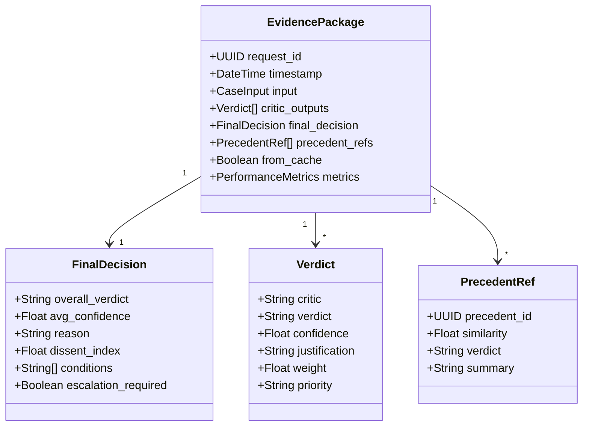
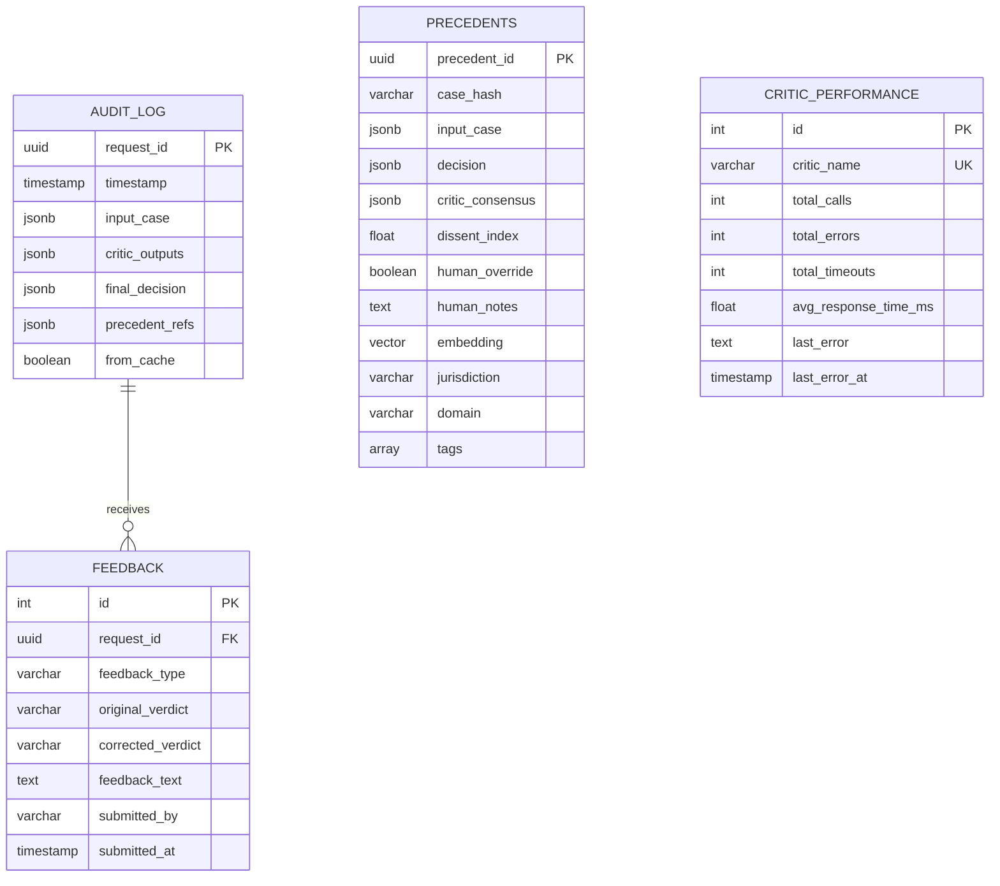

# Appendix C: RBJA Schema Definitions

**Rights-Based Jurisprudence Architecture (RBJA) v3.0**  
**Document Status:** Production Reference  
**Last Updated:** November 2024

---

## Table of Contents

1. [Overview](#overview)
2. [Schema Versioning](#schema-versioning)
3. [Core Schemas](#core-schemas)
4. [API Schemas](#api-schemas)
5. [Database Schemas](#database-schemas)
6. [Migration Schemas](#migration-schemas)
7. [Validation Rules](#validation-rules)

---

## Overview

This appendix provides canonical definitions for all ELEANOR data structures in JSON Schema, YAML, and SQL formats. These schemas are:

- **Normative:** Implementations must conform to these schemas
- **Versioned:** Schema changes follow semantic versioning
- **Validated:** All data validated against schemas before processing
- **Documented:** Each field includes purpose, constraints, examples

### Schema Hierarchy



---

## Schema Versioning

### Version Format

```
MAJOR.MINOR.PATCH
```

- **MAJOR:** Breaking changes (field removal, type changes)
- **MINOR:** Backward-compatible additions (new optional fields)
- **PATCH:** Documentation updates, no schema changes

### Current Versions

| Schema | Version | Status |
|--------|---------|--------|
| CaseInput | 3.0.0 | Current |
| Verdict | 3.0.0 | Current |
| EvidencePackage | 3.0.0 | Current |
| PrecedentRecord | 3.0.0 | Current |
| EscalationBundle | 3.0.0 | Current |
| DecisionResponse | 3.0.0 | Current |

---

## Core Schemas

### CaseInput Schema

**Purpose:** Input for decision evaluation

**JSON Schema:**

```json
{
  "$schema": "http://json-schema.org/draft-07/schema#",
  "$id": "https://eleanor.ai/schemas/case-input/v3.0.0",
  "title": "CaseInput",
  "description": "Input case for ethical evaluation by ELEANOR",
  "type": "object",
  "required": ["text", "domain"],
  "properties": {
    "text": {
      "type": "string",
      "description": "The scenario or decision to evaluate",
      "minLength": 10,
      "maxLength": 10000,
      "examples": [
        "Should we approve this loan application?",
        "Deploy facial recognition in retail store"
      ]
    },
    "domain": {
      "type": "string",
      "description": "Domain identifier for context-specific evaluation",
      "enum": [
        "healthcare",
        "finance",
        "government",
        "employment",
        "education",
        "criminal_justice",
        "insurance",
        "retail",
        "public_safety",
        "general"
      ],
      "examples": ["healthcare", "finance"]
    },
    "priority": {
      "type": "string",
      "description": "Priority level for processing and escalation",
      "enum": ["low", "normal", "high", "critical"],
      "default": "normal"
    },
    "context": {
      "type": "object",
      "description": "Additional structured context for the decision",
      "additionalProperties": true,
      "examples": [
        {
          "credit_score": 680,
          "loan_amount": 50000,
          "debt_to_income": 0.42
        }
      ]
    },
    "metadata": {
      "type": "object",
      "description": "Metadata about the request",
      "properties": {
        "source_system": {
          "type": "string",
          "description": "Originating system identifier"
        },
        "user_id": {
          "type": "string",
          "description": "User or service account making request"
        },
        "session_id": {
          "type": "string",
          "description": "Session identifier for correlation"
        },
        "correlation_id": {
          "type": "string",
          "description": "External correlation ID for tracing"
        }
      }
    }
  }
}
```

**YAML Example:**

```yaml
text: "Should we approve this experimental medical treatment?"
domain: healthcare
priority: high
context:
  patient_age: 45
  diagnosis: rare_condition
  success_rate: 0.60
  cost: high
  alternatives_exhausted: true
metadata:
  source_system: electronic_health_record
  user_id: dr_smith
  session_id: ses_123abc
```

**Python Pydantic Model:**

```python
from pydantic import BaseModel, Field, validator
from typing import Optional, Dict, Any
from enum import Enum

class Priority(str, Enum):
    LOW = "low"
    NORMAL = "normal"
    HIGH = "high"
    CRITICAL = "critical"

class Domain(str, Enum):
    HEALTHCARE = "healthcare"
    FINANCE = "finance"
    GOVERNMENT = "government"
    EMPLOYMENT = "employment"
    EDUCATION = "education"
    CRIMINAL_JUSTICE = "criminal_justice"
    INSURANCE = "insurance"
    RETAIL = "retail"
    PUBLIC_SAFETY = "public_safety"
    GENERAL = "general"

class CaseInput(BaseModel):
    text: str = Field(
        ...,
        min_length=10,
        max_length=10000,
        description="The scenario or decision to evaluate"
    )
    domain: Domain = Field(
        ...,
        description="Domain identifier for context-specific evaluation"
    )
    priority: Priority = Field(
        default=Priority.NORMAL,
        description="Priority level for processing and escalation"
    )
    context: Optional[Dict[str, Any]] = Field(
        default=None,
        description="Additional structured context for the decision"
    )
    metadata: Optional[Dict[str, Any]] = Field(
        default=None,
        description="Metadata about the request"
    )
    
    @validator('text')
    def text_not_empty(cls, v):
        if not v or not v.strip():
            raise ValueError('Case text cannot be empty')
        return v.strip()
    
    class Config:
        schema_extra = {
            "example": {
                "text": "Should we approve this loan application?",
                "domain": "finance",
                "priority": "normal",
                "context": {
                    "credit_score": 680,
                    "requested_amount": 50000
                }
            }
        }
```

---

### Verdict Schema

**Purpose:** Individual critic's evaluation result

**JSON Schema:**

```json
{
  "$schema": "http://json-schema.org/draft-07/schema#",
  "$id": "https://eleanor.ai/schemas/verdict/v3.0.0",
  "title": "Verdict",
  "description": "Individual critic's evaluation verdict",
  "type": "object",
  "required": ["critic", "verdict", "confidence", "justification"],
  "properties": {
    "critic": {
      "type": "string",
      "description": "Critic identifier",
      "examples": ["RightsCritic", "EquityAnalyzer", "RiskAssessor"]
    },
    "verdict": {
      "type": "string",
      "description": "The critic's decision",
      "enum": ["ALLOW", "DENY", "REVIEW"],
      "examples": ["ALLOW", "DENY"]
    },
    "confidence": {
      "type": "number",
      "description": "Confidence score (0.0-1.0)",
      "minimum": 0.0,
      "maximum": 1.0,
      "examples": [0.85, 0.92]
    },
    "justification": {
      "type": "string",
      "description": "Human-readable explanation of the verdict",
      "minLength": 20,
      "examples": [
        "This action respects patient autonomy and informed consent requirements."
      ]
    },
    "weight": {
      "type": "number",
      "description": "Weight of this critic in aggregation",
      "minimum": 0.0,
      "default": 1.0,
      "examples": [1.0, 1.5, 2.0]
    },
    "priority": {
      "type": ["string", "null"],
      "description": "Priority level (override = veto authority)",
      "enum": ["override", null],
      "default": null
    },
    "flags": {
      "type": "array",
      "description": "Specific concerns flagged by this critic",
      "items": {
        "type": "string",
        "enum": [
          "RIGHTS_CONCERN",
          "PRIVACY_VIOLATION",
          "DISCRIMINATION",
          "EQUITY_IMPACT",
          "DISPARATE_IMPACT",
          "TRANSPARENCY_ISSUE",
          "SAFETY_RISK",
          "CATASTROPHIC_RISK",
          "REGULATORY_VIOLATION",
          "PRAGMATIC_FAILURE",
          "CONTEXT_MISMATCH",
          "CONSENT_MISSING",
          "COERCION",
          "IRREVERSIBLE_HARM"
        ]
      },
      "examples": [
        ["PRIVACY_VIOLATION", "CONSENT_MISSING"]
      ]
    },
    "conditions": {
      "type": "array",
      "description": "Required conditions if verdict is conditional ALLOW",
      "items": {
        "type": "string"
      },
      "examples": [
        ["human_oversight_required", "annual_audit_mandatory"]
      ]
    },
    "metadata": {
      "type": "object",
      "description": "Critic execution metadata",
      "properties": {
        "execution_time_ms": {
          "type": "number",
          "description": "Time taken to execute critic (milliseconds)"
        },
        "api_calls": {
          "type": "integer",
          "description": "Number of LLM API calls made"
        },
        "cache_hit": {
          "type": "boolean",
          "description": "Was result retrieved from cache"
        },
        "model_version": {
          "type": "string",
          "description": "LLM model version used"
        }
      }
    }
  }
}
```

**YAML Example:**

```yaml
critic: RightsCritic
verdict: DENY
confidence: 0.95
justification: |
  This action violates patient privacy rights by collecting sensitive
  health data without explicit consent. HIPAA regulations require clear
  opt-in for data use beyond direct care.
weight: 1.0
priority: override
flags:
  - PRIVACY_VIOLATION
  - CONSENT_MISSING
  - REGULATORY_VIOLATION
conditions: []
metadata:
  execution_time_ms: 2350
  api_calls: 1
  cache_hit: false
  model_version: claude-sonnet-4-20250514
```

---

### EvidencePackage Schema

**Purpose:** Complete decision record for audit trail

**JSON Schema:**

```json
{
  "$schema": "http://json-schema.org/draft-07/schema#",
  "$id": "https://eleanor.ai/schemas/evidence-package/v3.0.0",
  "title": "EvidencePackage",
  "description": "Complete decision record with full audit trail",
  "type": "object",
  "required": [
    "request_id",
    "timestamp",
    "input",
    "critic_outputs",
    "final_decision"
  ],
  "properties": {
    "request_id": {
      "type": "string",
      "format": "uuid",
      "description": "Unique identifier for this decision",
      "examples": ["550e8400-e29b-41d4-a716-446655440000"]
    },
    "timestamp": {
      "type": "string",
      "format": "date-time",
      "description": "ISO 8601 timestamp of decision",
      "examples": ["2024-11-25T14:30:00Z"]
    },
    "input": {
      "$ref": "#/definitions/CaseInput",
      "description": "Original input case"
    },
    "critic_outputs": {
      "type": "array",
      "description": "All critic verdicts",
      "items": {
        "$ref": "#/definitions/Verdict"
      },
      "minItems": 1
    },
    "final_decision": {
      "type": "object",
      "description": "Aggregated final decision",
      "required": [
        "overall_verdict",
        "avg_confidence",
        "reason",
        "dissent_index"
      ],
      "properties": {
        "overall_verdict": {
          "type": "string",
          "enum": ["ALLOW", "DENY", "REVIEW"]
        },
        "avg_confidence": {
          "type": "number",
          "minimum": 0.0,
          "maximum": 1.0
        },
        "reason": {
          "type": "string",
          "minLength": 50,
          "description": "Primary justification for decision"
        },
        "dissent_index": {
          "type": "number",
          "minimum": 0.0,
          "maximum": 1.0,
          "description": "Measure of critic disagreement (0=consensus, 1=complete disagreement)"
        },
        "conditions": {
          "type": "array",
          "items": {"type": "string"},
          "description": "Required conditions if verdict is conditional"
        },
        "escalation_required": {
          "type": "boolean",
          "description": "Whether human review is required"
        }
      }
    },
    "precedent_refs": {
      "type": "array",
      "description": "Similar historical cases",
      "items": {
        "type": "object",
        "properties": {
          "precedent_id": {"type": "string", "format": "uuid"},
          "similarity": {"type": "number", "minimum": 0.0, "maximum": 1.0},
          "verdict": {"type": "string"},
          "summary": {"type": "string"}
        }
      }
    },
    "from_cache": {
      "type": "boolean",
      "default": false,
      "description": "Was this result retrieved from cache"
    },
    "performance_metrics": {
      "type": "object",
      "description": "Performance telemetry",
      "properties": {
        "total_time_ms": {"type": "number"},
        "critic_time_ms": {"type": "number"},
        "precedent_time_ms": {"type": "number"},
        "database_time_ms": {"type": "number"},
        "cache_hit": {"type": "boolean"}
      }
    }
  }
}
```

**Visualization:**



---

### PrecedentRecord Schema

**Purpose:** Machine-readable case law

**JSON Schema:**

```json
{
  "$schema": "http://json-schema.org/draft-07/schema#",
  "$id": "https://eleanor.ai/schemas/precedent-record/v3.0.0",
  "title": "PrecedentRecord",
  "description": "Stored precedent for future reference",
  "type": "object",
  "required": [
    "precedent_id",
    "case_hash",
    "input_case",
    "decision",
    "created_at"
  ],
  "properties": {
    "precedent_id": {
      "type": "string",
      "format": "uuid",
      "description": "Unique precedent identifier"
    },
    "case_hash": {
      "type": "string",
      "pattern": "^[a-f0-9]{64}$",
      "description": "SHA-256 hash of normalized input"
    },
    "input_case": {
      "type": "object",
      "description": "Anonymized input case"
    },
    "decision": {
      "type": "object",
      "description": "Final decision details",
      "properties": {
        "overall_verdict": {"type": "string"},
        "avg_confidence": {"type": "number"},
        "reason": {"type": "string"}
      }
    },
    "critic_consensus": {
      "type": "object",
      "description": "Summary of critic verdicts",
      "properties": {
        "allow_count": {"type": "integer"},
        "deny_count": {"type": "integer"},
        "review_count": {"type": "integer"},
        "primary_concerns": {
          "type": "array",
          "items": {"type": "string"}
        }
      }
    },
    "dissent_index": {
      "type": "number",
      "minimum": 0.0,
      "maximum": 1.0,
      "description": "Measure of critic disagreement"
    },
    "human_override": {
      "type": "boolean",
      "description": "Was human review involved"
    },
    "human_notes": {
      "type": ["string", "null"],
      "description": "Human reviewer's annotations"
    },
    "embedding": {
      "type": "array",
      "description": "Vector embedding for semantic search (768 dimensions)",
      "items": {"type": "number"},
      "minItems": 768,
      "maxItems": 768
    },
    "jurisdiction": {
      "type": "string",
      "description": "Legal jurisdiction",
      "examples": ["US", "EU", "US_CA", "US_Healthcare"]
    },
    "domain": {
      "type": "string",
      "description": "Domain identifier"
    },
    "tags": {
      "type": "array",
      "description": "Classification tags",
      "items": {"type": "string"},
      "examples": [
        ["privacy", "healthcare", "consent"]
      ]
    },
    "created_at": {
      "type": "string",
      "format": "date-time"
    },
    "updated_at": {
      "type": "string",
      "format": "date-time"
    },
    "precedent_version": {
      "type": "string",
      "pattern": "^\\d+\\.\\d+\\.\\d+$",
      "description": "Schema version",
      "examples": ["3.0.0"]
    },
    "migration_status": {
      "type": "string",
      "enum": ["NATIVE", "MIGRATED", "PARTIAL"],
      "description": "Schema migration status"
    }
  }
}
```

---

### EscalationBundle Schema

**Purpose:** Package for human review

**JSON Schema:**

```json
{
  "$schema": "http://json-schema.org/draft-07/schema#",
  "$id": "https://eleanor.ai/schemas/escalation-bundle/v3.0.0",
  "title": "EscalationBundle",
  "description": "Package for human review of escalated decisions",
  "type": "object",
  "required": [
    "request_id",
    "timestamp",
    "priority",
    "input_case",
    "critic_matrix",
    "dissent_index"
  ],
  "properties": {
    "request_id": {
      "type": "string",
      "format": "uuid"
    },
    "timestamp": {
      "type": "string",
      "format": "date-time"
    },
    "priority": {
      "type": "string",
      "enum": ["LOW", "MEDIUM", "HIGH", "CRITICAL"],
      "description": "Escalation priority for SLA enforcement"
    },
    "input_case": {
      "type": "object",
      "description": "Original case input"
    },
    "critic_matrix": {
      "type": "array",
      "description": "All critic verdicts",
      "items": {
        "$ref": "#/definitions/Verdict"
      }
    },
    "dissent_index": {
      "type": "number",
      "description": "Measure of critic disagreement"
    },
    "proposed_action": {
      "type": "string",
      "description": "Proposed action if allowed"
    },
    "precedents_considered": {
      "type": "array",
      "description": "Similar precedents",
      "items": {
        "type": "object"
      }
    },
    "explanation_summary": {
      "type": "string",
      "description": "Executive summary for reviewers"
    },
    "recommended_questions": {
      "type": "array",
      "description": "Questions for reviewers to consider",
      "items": {"type": "string"},
      "examples": [
        [
          "Are the privacy safeguards sufficient for this use case?",
          "What are the potential unintended consequences?",
          "Are there less intrusive alternatives?"
        ]
      ]
    },
    "risk_flags": {
      "type": "array",
      "items": {"type": "string"}
    },
    "rights_flags": {
      "type": "array",
      "items": {"type": "string"}
    },
    "equity_flags": {
      "type": "array",
      "items": {"type": "string"}
    },
    "context_flags": {
      "type": "array",
      "items": {"type": "string"}
    },
    "estimated_review_time": {
      "type": "string",
      "description": "Estimated time for review",
      "examples": ["15 minutes", "1 hour"]
    },
    "related_cases": {
      "type": "array",
      "description": "Related escalated cases",
      "items": {
        "type": "string",
        "format": "uuid"
      }
    },
    "sla_deadline": {
      "type": "string",
      "format": "date-time",
      "description": "Deadline for review based on priority"
    }
  }
}
```

---

## API Schemas

### DecisionResponse Schema

**Purpose:** API response for evaluation requests

**OpenAPI 3.0 Definition:**

```yaml
DecisionResponse:
  type: object
  required:
    - request_id
    - timestamp
    - input
    - final_decision
    - critic_outputs
  properties:
    request_id:
      type: string
      format: uuid
      description: Unique identifier for this decision
      example: "550e8400-e29b-41d4-a716-446655440000"
    
    timestamp:
      type: string
      format: date-time
      description: ISO 8601 timestamp
      example: "2024-11-25T14:30:00Z"
    
    input:
      $ref: '#/components/schemas/CaseInput'
    
    final_decision:
      type: object
      required:
        - overall_verdict
        - avg_confidence
        - reason
      properties:
        overall_verdict:
          type: string
          enum: [ALLOW, DENY, REVIEW]
          description: Final aggregated decision
        avg_confidence:
          type: number
          format: float
          minimum: 0.0
          maximum: 1.0
          description: Average confidence across critics
        reason:
          type: string
          description: Primary justification
        dissent_index:
          type: number
          format: float
          description: Measure of disagreement
        conditions:
          type: array
          items:
            type: string
          description: Required conditions if conditional approval
        escalation_required:
          type: boolean
          description: Whether human review needed
    
    critic_outputs:
      type: array
      items:
        $ref: '#/components/schemas/Verdict'
      description: All critic verdicts
    
    precedent_refs:
      type: array
      items:
        type: object
        properties:
          precedent_id:
            type: string
            format: uuid
          similarity:
            type: number
            format: float
          verdict:
            type: string
          summary:
            type: string
      description: Similar historical cases
    
    from_cache:
      type: boolean
      default: false
      description: Whether result was cached
    
    performance_metrics:
      type: object
      properties:
        total_time_ms:
          type: number
          format: float
        critic_time_ms:
          type: number
          format: float
        precedent_time_ms:
          type: number
          format: float
```

### ErrorResponse Schema

**Purpose:** Standardized error responses

```yaml
ErrorResponse:
  type: object
  required:
    - error
    - timestamp
  properties:
    error:
      type: string
      description: Error message
      example: "Invalid input: case text too short"
    
    error_code:
      type: string
      description: Machine-readable error code
      example: "VALIDATION_ERROR"
    
    timestamp:
      type: string
      format: date-time
    
    path:
      type: string
      description: API endpoint where error occurred
      example: "/evaluate"
    
    request_id:
      type: string
      format: uuid
      description: Request ID for troubleshooting
    
    details:
      type: object
      description: Additional error details
      additionalProperties: true
```

---

## Database Schemas

### SQL Schema Definitions

**PostgreSQL DDL:**

```sql
-- audit_log table
CREATE TABLE audit_log (
    id SERIAL PRIMARY KEY,
    request_id UUID NOT NULL UNIQUE,
    timestamp TIMESTAMP NOT NULL DEFAULT CURRENT_TIMESTAMP,
    input_case JSONB NOT NULL,
    critic_outputs JSONB NOT NULL,
    final_decision JSONB NOT NULL,
    precedent_refs JSONB,
    from_cache BOOLEAN DEFAULT FALSE,
    created_at TIMESTAMP NOT NULL DEFAULT CURRENT_TIMESTAMP,
    
    -- Indexes
    CONSTRAINT audit_log_request_id_key UNIQUE (request_id)
);

CREATE INDEX idx_audit_log_timestamp ON audit_log(timestamp DESC);
CREATE INDEX idx_audit_log_request_id ON audit_log(request_id);
CREATE INDEX idx_audit_log_verdict ON audit_log((final_decision->>'overall_verdict'));
CREATE INDEX idx_audit_log_domain ON audit_log((input_case->>'domain'));

-- Prevent updates (append-only log)
CREATE RULE audit_log_no_update AS
    ON UPDATE TO audit_log
    DO INSTEAD NOTHING;

CREATE RULE audit_log_no_delete AS
    ON DELETE TO audit_log
    DO INSTEAD NOTHING;
```

```sql
-- precedents table
CREATE TABLE precedents (
    id SERIAL PRIMARY KEY,
    precedent_id UUID NOT NULL UNIQUE DEFAULT gen_random_uuid(),
    case_hash VARCHAR(64) NOT NULL,
    input_case JSONB NOT NULL,
    decision JSONB NOT NULL,
    critic_consensus JSONB,
    dissent_index FLOAT,
    human_override BOOLEAN DEFAULT FALSE,
    human_notes TEXT,
    embedding VECTOR(768),  -- Requires pgvector extension
    jurisdiction VARCHAR(50),
    domain VARCHAR(50),
    tags TEXT[],
    created_at TIMESTAMP NOT NULL DEFAULT CURRENT_TIMESTAMP,
    updated_at TIMESTAMP NOT NULL DEFAULT CURRENT_TIMESTAMP,
    precedent_version VARCHAR(20) NOT NULL DEFAULT '3.0.0',
    migration_status VARCHAR(20) DEFAULT 'NATIVE',
    
    -- Indexes
    CONSTRAINT precedents_precedent_id_key UNIQUE (precedent_id)
);

CREATE INDEX idx_precedents_case_hash ON precedents(case_hash);
CREATE INDEX idx_precedents_created_at ON precedents(created_at DESC);
CREATE INDEX idx_precedents_jurisdiction ON precedents(jurisdiction);
CREATE INDEX idx_precedents_domain ON precedents(domain);
CREATE INDEX idx_precedents_tags ON precedents USING GIN(tags);

-- Vector similarity index for semantic search
CREATE INDEX idx_precedents_embedding ON precedents 
    USING ivfflat (embedding vector_cosine_ops)
    WITH (lists = 100);
```

```sql
-- feedback table
CREATE TABLE feedback (
    id SERIAL PRIMARY KEY,
    request_id UUID NOT NULL REFERENCES audit_log(request_id),
    feedback_type VARCHAR(50) NOT NULL,
    original_verdict VARCHAR(50),
    corrected_verdict VARCHAR(50),
    feedback_text TEXT,
    submitted_by VARCHAR(255),
    submitted_at TIMESTAMP NOT NULL DEFAULT CURRENT_TIMESTAMP,
    
    CONSTRAINT valid_feedback_type 
        CHECK (feedback_type IN ('correction', 'approval', 'concern', 'comment'))
);

CREATE INDEX idx_feedback_request_id ON feedback(request_id);
CREATE INDEX idx_feedback_type ON feedback(feedback_type);
CREATE INDEX idx_feedback_submitted_at ON feedback(submitted_at DESC);
```

```sql
-- critic_performance table
CREATE TABLE critic_performance (
    id SERIAL PRIMARY KEY,
    critic_name VARCHAR(100) NOT NULL UNIQUE,
    total_calls INTEGER DEFAULT 0,
    total_errors INTEGER DEFAULT 0,
    total_timeouts INTEGER DEFAULT 0,
    avg_response_time_ms FLOAT,
    last_error TEXT,
    last_error_at TIMESTAMP,
    last_success_at TIMESTAMP,
    created_at TIMESTAMP NOT NULL DEFAULT CURRENT_TIMESTAMP,
    updated_at TIMESTAMP NOT NULL DEFAULT CURRENT_TIMESTAMP
);

CREATE INDEX idx_critic_performance_name ON critic_performance(critic_name);
```

### Entity Relationship Diagram



---

## Migration Schemas

### PrecedentMigrationMap Schema

**Purpose:** Map old precedent schemas to current version

```json
{
  "$schema": "http://json-schema.org/draft-07/schema#",
  "$id": "https://eleanor.ai/schemas/migration-map/v3.0.0",
  "title": "PrecedentMigrationMap",
  "description": "Schema migration mapping",
  "type": "object",
  "required": ["source_version", "target_version", "field_mappings"],
  "properties": {
    "source_version": {
      "type": "string",
      "pattern": "^\\d+\\.\\d+\\.\\d+$",
      "examples": ["2.1.0"]
    },
    "target_version": {
      "type": "string",
      "pattern": "^\\d+\\.\\d+\\.\\d+$",
      "examples": ["3.0.0"]
    },
    "field_mappings": {
      "type": "object",
      "description": "Map of old field names to new field names",
      "additionalProperties": {
        "type": "object",
        "properties": {
          "target_field": {"type": "string"},
          "transform": {"type": "string"},
          "default_value": {}
        }
      }
    },
    "critic_mappings": {
      "type": "object",
      "description": "Map old critic IDs to new critic IDs"
    },
    "verdict_mappings": {
      "type": "object",
      "description": "Map old verdict values to new values"
    }
  }
}
```

**Example Migration Map (v2.1 → v3.0):**

```yaml
source_version: "2.1.0"
target_version: "3.0.0"

field_mappings:
  verdict:
    target_field: decision.overall_verdict
    transform: "uppercase"
  
  confidence:
    target_field: decision.avg_confidence
    transform: "identity"
  
  case_data:
    target_field: input_case
    transform: "identity"

critic_mappings:
  Eleanor: RightsCritic
  Equity: EquityAnalyzer
  Risk: RiskAssessor

verdict_mappings:
  allow: ALLOW
  deny: DENY
  escalate: REVIEW
  conditional: ALLOW  # v2.1 conditional becomes ALLOW in v3.0

required_new_fields:
  case_hash:
    transform: "sha256(normalize(input_case))"
  
  embedding:
    transform: "generate_embedding(input_case.text)"
    optional: true  # Mark as PARTIAL if can't generate
  
  precedent_version:
    default_value: "3.0.0"
  
  migration_status:
    default_value: "MIGRATED"
```

---

## Validation Rules

### Input Validation

**Python Validators:**

```python
from pydantic import validator, root_validator

class CaseInputValidator:
    
    @validator('text')
    def validate_text(cls, v):
        """Text must be substantive"""
        if len(v.strip()) < 10:
            raise ValueError('Case text too short (min 10 characters)')
        if len(v) > 10000:
            raise ValueError('Case text too long (max 10000 characters)')
        
        # Check for injection attempts
        if any(char in v for char in ['<script>', '<?php']):
            raise ValueError('Potential injection detected')
        
        return v.strip()
    
    @validator('domain')
    def validate_domain(cls, v):
        """Domain must be recognized"""
        valid_domains = [
            'healthcare', 'finance', 'government', 'employment',
            'education', 'criminal_justice', 'insurance', 
            'retail', 'public_safety', 'general'
        ]
        if v not in valid_domains:
            raise ValueError(f'Unknown domain: {v}')
        return v
    
    @root_validator
    def validate_context(cls, values):
        """Validate context makes sense for domain"""
        domain = values.get('domain')
        context = values.get('context', {})
        
        if domain == 'healthcare' and context:
            # Healthcare-specific validation
            if 'patient_age' in context:
                age = context['patient_age']
                if not (0 <= age <= 150):
                    raise ValueError('Invalid patient age')
        
        return values
```

### Schema Validation

**JSON Schema Validation:**

```python
import jsonschema
from jsonschema import validate, ValidationError

def validate_verdict(verdict_data):
    """Validate verdict against schema"""
    schema = load_schema('verdict', version='3.0.0')
    
    try:
        validate(instance=verdict_data, schema=schema)
        return True
    except ValidationError as e:
        raise ValueError(f"Verdict validation failed: {e.message}")

def validate_evidence_package(evidence_data):
    """Validate evidence package"""
    schema = load_schema('evidence-package', version='3.0.0')
    
    try:
        validate(instance=evidence_data, schema=schema)
        
        # Additional semantic validation
        if evidence_data['final_decision']['dissent_index'] > 0.5:
            # High dissent should trigger review
            if evidence_data['final_decision']['overall_verdict'] != 'REVIEW':
                warnings.warn("High dissent without REVIEW verdict")
        
        return True
    except ValidationError as e:
        raise ValueError(f"Evidence package validation failed: {e.message}")
```

---

## Schema Evolution Guidelines

### Adding Fields (MINOR version bump)

```yaml
# OLD (v3.0.0)
properties:
  text: {type: string}
  domain: {type: string}

# NEW (v3.1.0) - Backward compatible
properties:
  text: {type: string}
  domain: {type: string}
  language: {type: string, default: "en"}  # New optional field
```

### Changing Field Types (MAJOR version bump)

```yaml
# OLD (v3.0.0)
properties:
  confidence: {type: number}

# NEW (v4.0.0) - Breaking change
properties:
  confidence: 
    type: object
    properties:
      value: {type: number}
      source: {type: string}
```

### Deprecation Process

1. **Announce deprecation** (N.0.0)
   ```yaml
   deprecated: true
   deprecation_notice: "Use 'new_field' instead. Will be removed in v(N+1).0.0"
   ```

2. **Support both fields** (N.x.x)
   - Old field continues to work
   - Documentation shows new field

3. **Remove old field** (N+1.0.0)
   - Migration map provided
   - Release notes document change

---

## Appendix: Schema Files

All canonical schema files available at:
- **JSON Schema:** `/schemas/json/`
- **YAML:** `/schemas/yaml/`
- **SQL DDL:** `/schemas/sql/`
- **Python Models:** `/src/eje/core/schemas/`
- **OpenAPI:** `/docs/api/openapi.yaml`

---

**Document Control**

| Version | Date | Author | Changes |
|---------|------|--------|---------|
| 1.0 | 2024-11-25 | William Parris | Initial version for v3.0 spec |

**Approval**

- Governance Committee: _______________________
- Technical Lead: _______________________
- Data Architect: _______________________
- Date: _______________________
