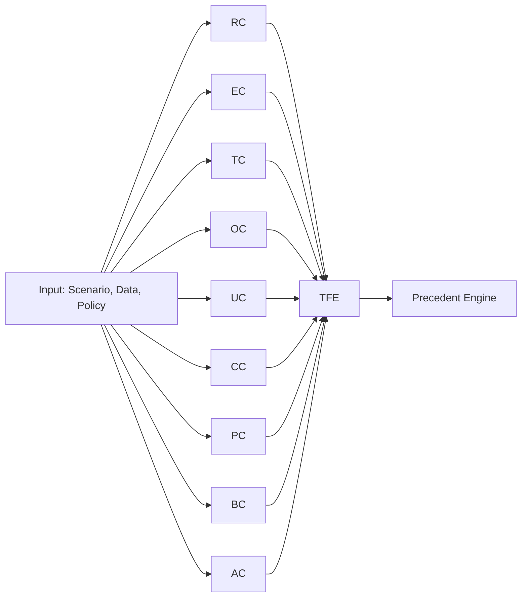

# Multi-Critic Signal Flow Diagram

## Critics

### Existing (Phase 1-2)
- **RC**: Rights Critic - Fundamental rights protection
- **EC**: Equity Critic - Fairness and equity analysis
- **TC**: Transparency Critic - Explainability assessment
- **OC**: Operations Critic - Feasibility and safety

### New (Phase 5)
- **UC**: Uncertainty Critic - Epistemic/aleatory uncertainty quantification
- **CC**: Context Critic - Cultural, jurisdictional, domain awareness
- **PC**: Privacy Protection Critic - PET-aware privacy analysis
- **BC**: Bias & Objectivity Integrity Critic - Comprehensive fairness
- **AC**: Accountability Critic - Traceability and responsibility

## Flow

1. All critics analyze input in parallel
2. Results feed into Ethical Trade-Off Engine (TFE)
3. TFE detects conflicts and recommends resolutions
4. Precedent Engine applies historical learning
