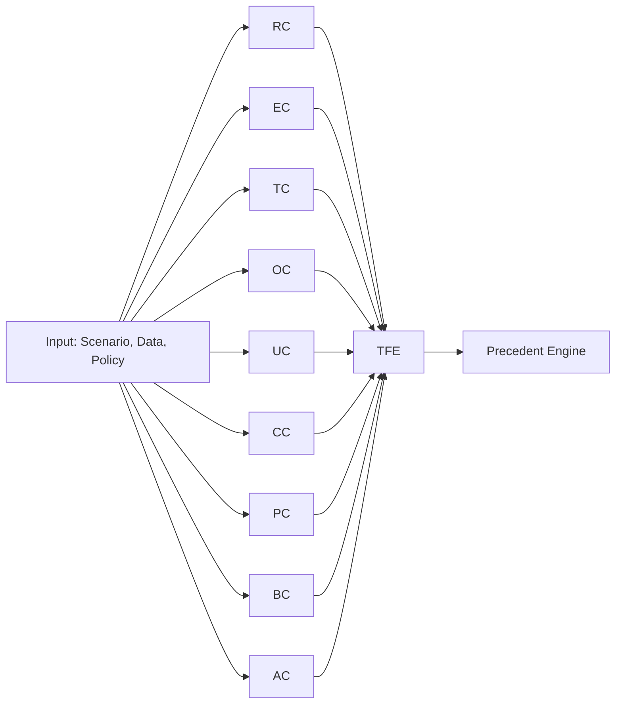
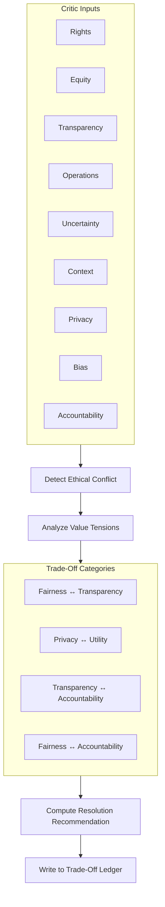
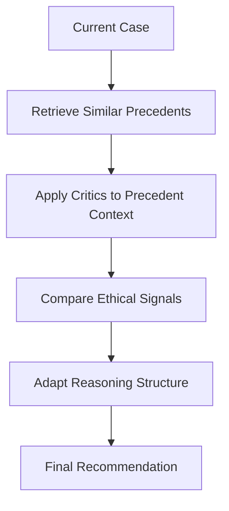
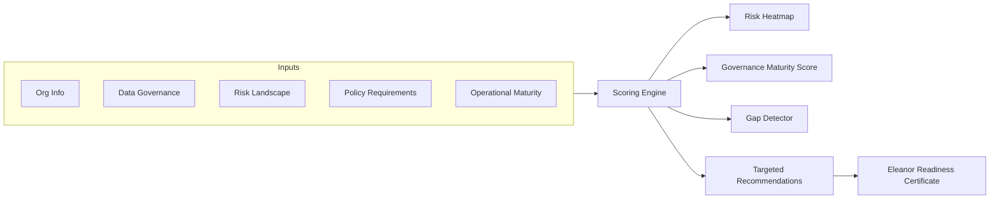
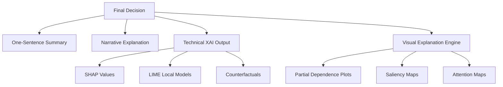

# Eleanor v7 Complete Architecture Diagrams

## 1. High-Level System Architecture

```mermaid
flowchart TB
    subgraph User[Human Stakeholder / Org]
    end

    subgraph InputLayer[Input Layer]
        DataRequest[Data Request]
        Scenario[Scenario Description]
        Documents[Policy / Legal Inputs]
    end

    subgraph EJC[Ethical Jurisprudence Core]
        subgraph Critics[Multi-Critic Architecture]
            RC[Rights Critic]
            EC[Equity Critic]
            TC[Transparency Critic]
            OC[Operations Critic]
            UC[Uncertainty Critic]
            CC[Context Critic]
            PC[Privacy Protection Critic]
            BC[Bias & Objectivity Integrity Critic]
            AC[Accountability Critic]
        end

        TFE[Ethical Trade-Off Engine]
        PEL[PET-Aware Data Layer]
        GML[Governance Mode Layer]
        PRE[Precedent Engine]
    end

    subgraph OutputPack[Multimodal Explainability Pack]
        Short[One-Sentence Explanation]
        Para[Narrative Explanation]
        Tech[Technical / XAI Explanation]
        Visual[Visuals: SHAP, PDP, Saliency]
    end

    Cert[Eleanor Readiness Certificate (ERC)]
    Logs[Audit Logs / Decision Ledger]

    User --> InputLayer --> EJC --> OutputPack --> User
    EJC --> Cert
    EJC --> Logs
```

## 2. Multi-Critic Signal Flow



## 3. PET-Aware Data Handling

```mermaid
flowchart TB

    subgraph DataIn[Incoming Data]
        Raw[Raw Input Data]
        Meta[Metadata]
        Sens[Personal / Sensitive Data]
    end

    Raw --> Min[Data Minimization]
    Sens --> PETSel[PET Recommendation Engine]
    PETSel -->{
        DP[Apply Differential Privacy]
        FL[Federated Learning]
        HE[Homomorphic Encryption]
        MPC[Secure MPC]
        TEE[Trusted Execution Enclave]
    }

    Min --> PETSel
    DP --> Store[Secure Storage]
    FL --> Store
    HE --> Store
    MPC --> Store
    TEE --> Store
```

## 4. Ethical Trade-Off Engine



## 5. Governance Mode Layer

```mermaid
flowchart LR

    ModeSwitch[Governance Mode Switch] --> EU[EU AI Act Mode]
    ModeSwitch --> UN[UN Global Governance Mode]
    ModeSwitch --> OECD[OECD Principles Mode]
    ModeSwitch --> NIST[NIST AI RMF Mode]
    ModeSwitch --> KOR[Korea AI Basic Act Mode]
    ModeSwitch --> JPN[Japan Society 5.0 Mode]

    EU --> Config[Config Layer]
    UN --> Config
    OECD --> Config
    NIST --> Config
    KOR --> Config
    JPN --> Config

    Config -->{Thresholds, OversightLevels,ExplainabilityDepth, DataRequirements}
```

## 6. Precedent Engine



## 7. Eleanor Readiness Evaluator Dashboard



## 8. Multimodal Explainability Pack



## 9. Repository Architecture

```mermaid
flowchart LR

    root((ELEANOR-Project/Eleanor))

    subgraph Critics[/critics/]
        RIGHTS
        EQUITY
        TRANSPARENCY
        OPS
        UNCERTAINTY
        CONTEXT
        PRIVACY
        BIAS
        ACCOUNTABILITY
    end

    subgraph Core[/core/]
        TFE2[tradeoff_engine.py]
        PRE2[precedent_engine.py]
        GOV2[governance_modes.py]
        PET2[pet_layer.py]
    end

    subgraph Explain[/explainability/]
        XAI2[xai_pipeline.py]
        VIZ2[visual_generator.py]
        PACK2[explanation_pack.py]
    end

    subgraph EREv[/ere/]
        UI2[ui_wireframes/]
        Score2[scoring/]
        Cert2[certificate/]
    end

    root --> Critics
    root --> Core
    root --> Explain
    root --> EREv
```
